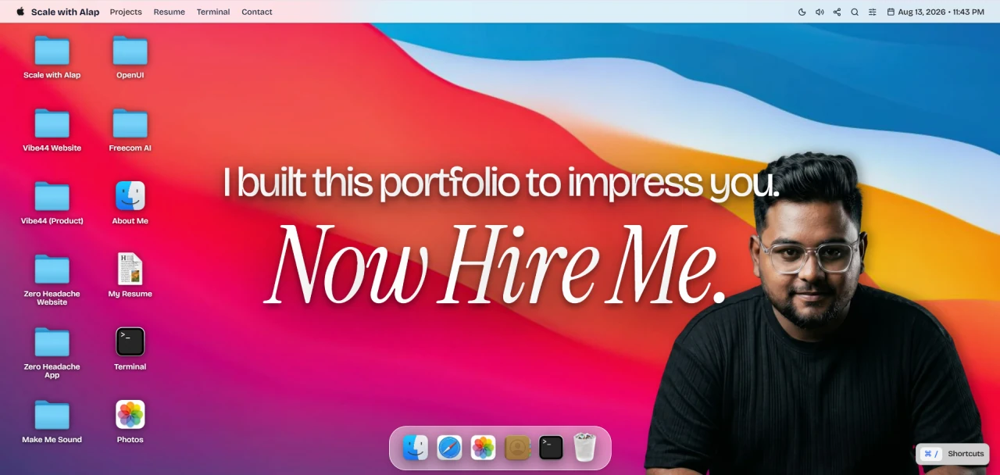

# Scale with Alap (Portfolio OS)

Interactive macOS-style Portfolio OS built by Alap Putatunda (AI Engineer & Full-stack Developer).

Live website: [scalewithalap.com](https://scalewithalap.com)  
GitHub repository: [github.com/scalewithalap/portfolio-os](https://github.com/scalewithalap/portfolio-os)



## Overview

This repository contains the source code for `scalewithalap.com`. The application recreates a desktop web operating system interface with custom window management, 8-axis window resizing, edge snapping, Zustand and Immer state handling, code-split application windows, Web Audio API synthesis, and a dock magnification engine using `requestAnimationFrame`.

## Core profile and background

- **Name:** Alap Putatunda
- **Role:** Founding AI Engineer & Full-Stack AI Developer (6+ years experience)
- **Location:** India (open to global remote roles or relocation with visa sponsorship)
- **Recognition:** Selected for "The Founding 500" by Hyperagent (Airtable) in June 2026 ($20,000 credit recipient)
- **Contact:** `hi@scalewithalap.com`
- **Main site:** [scalewithalap.com](https://scalewithalap.com)
- **GitHub:** [github.com/scalewithalap](https://github.com/scalewithalap)

## Key architecture features

- **Custom 8-axis window geometry manager:** Handles window dragging, 8-axis resizing (`n`, `s`, `e`, `w`, `ne`, `nw`, `se`, `sw`), quadrant edge snapping, z-index ordering, focus tracking, and window state persistence.
- **Zustand & Immer state engine:** Centralized state in `store/useEcosystemStore.ts` tracking open application instances, window geometries, theme selections, system notifications, audio settings, and command terminal history across 30+ state fields.
- **Dock magnification system:** Runs a cosine distance scaling algorithm via `requestAnimationFrame` with GPU-accelerated CSS 3D transforms.
- **Lazy-loaded code-splitting:** Uses `React.lazy` and `Suspense` to partition 13 separate application modules into individual JavaScript chunks.
- **Web Audio API synthesizer:** Generates real-time interactive audio feedback for UI clicks, window minimize actions, window close actions, and desktop interactions.
- **Responsive environment routing:** Switches automatically between a desktop windowing interface (`DesktopEnvironment`) and a mobile layout (`MobileEnvironment`) with a simulated Dynamic Island component based on screen dimensions and touch input capabilities.

## Technical stack

- **Core framework:** React 19 (`react` 19.0.1) with TypeScript (`typescript` ~5.8.2)
- **Build tool:** Vite 6 (`vite` ^6.2.3)
- **Styling:** Tailwind CSS v4 (`@tailwindcss/vite` ^4.1.14)
- **State management:** Zustand (`zustand` ^5.0.14) and Immer (`immer` ^11.1.11)
- **Animations:** Motion (`motion` ^12.23.24) and GSAP (`gsap` ^3.15.0)
- **Iconography:** Lucide React (`lucide-react` ^0.546.0)

## Case studies and projects

The portfolio includes 9 project case studies defined in `data/projectsData.ts` and `public/llms-full.txt`:

| Project                       | Category            | Live / Repo URL                                                                    | Codebase & Tech Stack                                                  | Key Metrics                                                     |
| :---------------------------- | :------------------ | :--------------------------------------------------------------------------------- | :--------------------------------------------------------------------- | :-------------------------------------------------------------- |
| **Scale with Alap**           | Portfolio OS        | [scalewithalap.com](https://scalewithalap.com)                                     | React 19, TypeScript, Vite, Tailwind v4, Zustand, Immer, Web Audio API | 39 source files, 30+ state fields, 13 lazy-loaded apps          |
| **Vibe44 Marketing Site**     | Next.js Starter Kit | [vibe44.com](https://vibe44.com)                                                   | Next.js 16 Route Handlers, JSON-RPC 2.0, Creem, Resend, Notion API     | 6 MCP tools, 4 resource templates, `/llms.txt` endpoint         |
| **Zero Headache Marketing**   | AI Agents           | [zeroheadache.co](https://zeroheadache.co)                                         | Next.js 16, React 19, Tailwind v4, GSAP ScrollTrigger, Lenis           | 12 inbound channels, 35+ CRM webhooks, ~17.2k lines             |
| **Vibe44 Starter Kit Engine** | Next.js Starter Kit | [demo.vibe44.com](https://demo.vibe44.com)                                         | Next.js 16, PostgreSQL, Supabase RLS, Drizzle ORM, Vitest, Playwright  | ~165k lines, 687 source files, 32 DB tables, 900+ unit tests    |
| **Zero Headache Platform**    | AI Agents           | [app.zeroheadache.co](https://app.zeroheadache.co)                                 | Next.js 16, Supabase RLS, OpenRouter, LangChain, MCP, Trigger.dev      | Per-client sandboxed AI agents, PostHog + Langfuse telemetry    |
| **OpenUI**                    | Open Source         | [github.com/scalewithalap/openui](https://github.com/scalewithalap/openui)         | Next.js 16, React 19, Prisma 7, SQLite, Tailwind v4                    | MIT license, local component generation, zero cloud DB          |
| **Make Me Sound**             | Desktop App         | [makemesound.xyz](https://makemesound.xyz)                                         | Next.js 16, Vercel AI SDK, OpenRouter, Supabase RLS, Upstash Redis     | 105 tone variations across 15 categories, parallel multi-stream |
| **Freecom AI**                | eCommerce           | [github.com/scalewithalap/freecom-ai](https://github.com/scalewithalap/freecom-ai) | Next.js 16, Supabase, Trigger.dev v4, Composio, Zernio API             | Open-source digital download platform, Store Manager Agent      |
| **Soothly AI**                | AI Agents           | [github.com/scalewithalap/soothly-ai](https://github.com/scalewithalap/soothly-ai) | Next.js 16, Supabase RLS, Inngest, pgvector, Lexical Editor            | 8 autonomous agents + Superagent manager, 3 autonomy tiers      |

## Codebase structure

```
scalewithalap/
├── public/
│   ├── files/                # Static downloadable files and resume PDFs
│   ├── icons/                # System application and dock icons
│   ├── images/               # Screenshots and portfolio assets
│   ├── llms.txt              # RAG ingestion summary file
│   ├── llms-full.txt         # Full Markdown documentation for LLM readers
│   ├── robots.txt            # Crawler indexation directives
│   ├── site.webmanifest      # Web application manifest
│   └── sitemap.xml           # XML sitemap index
├── apps/                     # 13 code-split application components
│   ├── projects/             # Individual project case study views
│   │   ├── FreecomApp.tsx
│   │   ├── MakeMeSoundApp.tsx
│   │   ├── OpenUIApp.tsx
│   │   ├── ScaleWithAlapApp.tsx
│   │   ├── SoothlyApp.tsx
│   │   ├── Vibe44App.tsx
│   │   ├── Vibe44DemoApp.tsx
│   │   ├── ZeroHeadacheApp.tsx
│   │   └── ZeroHeadachePlatformApp.tsx
│   ├── AboutApp.tsx          # Developer biography and experience history
│   ├── MailApp.tsx           # Contact form and message sender
│   ├── PhotosApp.tsx         # Screenshot gallery viewer
│   ├── ResumeApp.tsx         # Full interactive resume viewer
│   ├── SafariApp.tsx         # Simulated web browser
│   ├── SingleProjectApp.tsx     # Case study renderer
│   ├── TerminalApp.tsx       # Interactive terminal simulator
│   └── TrashApp.tsx          # System trash viewer
├── components/               # System UI overlays and shared elements
│   ├── ContextMenu.tsx
│   ├── ControlCenter.tsx
│   ├── ErrorBoundary.tsx
│   ├── LazyImage.tsx
│   ├── NotificationCenter.tsx
│   ├── SEOHead.tsx
│   ├── ShortcutsHintOverlay.tsx
│   ├── SpotlightSearch.tsx
│   └── ToastContainer.tsx
├── desktop/                  # macOS desktop interface components
│   ├── DesktopDock.tsx
│   ├── DesktopEnvironment.tsx
│   ├── DesktopFolders.tsx
│   ├── DesktopMenu.tsx
│   ├── DesktopWindowManager.tsx
│   ├── HeroHoverText.tsx
│   └── WindowFrame.tsx
├── mobile/                   # iOS mobile layout components
│   ├── DynamicIsland.tsx
│   │   ├── MobileEnvironment.tsx
│   │   └── MobileHome.tsx
│   ├── store/
│   │   └── useEcosystemStore.ts # Zustand + Immer state management store
│   ├── utils/
│   │   └── apps.ts           # Registry configurations for desktop applications
│   ├── data/
│   │   └── projectsData.ts   # Project case study datasets
│   ├── App.tsx               # Root app router and view renderer
│   ├── index.css             # CSS entry point with Tailwind directives
│   └── main.tsx              # React entry point
├── index.html                # HTML entry file
├── metadata.json             # Application metadata manifest
├── package.json              # NPM dependencies and script tasks
├── tsconfig.json             # TypeScript config
└── vite.config.ts            # Vite bundler setup
```

## State management model

State is managed globally by `useEcosystemStore.ts` using Zustand and Immer. The store handles:

- **Application lifecycle:** Tracks open app windows in `openApps`, active window focus in `focusedAppId`, and application configurations in `appsConfig`.
- **Window geometry state:** Stores positional coordinates `(x, y)`, dimensions `(width, height)`, `zIndex` layering values, and `isMinimized` flags per window ID.
- **System settings:** Controls light and dark themes (`theme`), Web Audio volume levels and mute states (`soundEnabled`), wallpaper image selections (`wallpaper`), and active notifications (`notifications`).
- **Interactive terminal:** Maintains command history and terminal output lines inside `TerminalApp`.

## Local development setup

### Prerequisites

- Node.js (version 18 or higher recommended)
- npm or pnpm

### Installation

1. Clone the repository:

   ```bash
   git clone https://github.com/scalewithalap/portfolio-os.git
   cd portfolio-os
   ```

2. Install dependencies:

   ```bash
   npm install
   ```

3. Start the local development server:
   ```bash
   npm run dev
   ```
   The application runs locally at `http://localhost:3000`.

## Available scripts

From `package.json`:

- `npm run dev`: Starts Vite dev server bound to port 3000 (`vite --port=3000 --host=0.0.0.0`).
- `npm run build`: Compiles production assets via `vite build`.
- `npm run preview`: Boots local preview server for production build verification via `vite preview`.
- `npm run lint`: Performs TypeScript type checks without emitting files (`tsc --noEmit`).
- `npm run clean`: Cleans build output directories (`dist` and `server.js`).

## Contact and links

- **Website:** [scalewithalap.com](https://scalewithalap.com)
- **Email:** hi@scalewithalap.com
- **GitHub:** [github.com/scalewithalap](https://github.com/scalewithalap)
- **LinkedIn:** [linkedin.com/in/scalewithalap](https://linkedin.com/in/scalewithalap)
- **X / Twitter:** [x.com/scalewithalap](https://x.com/scalewithalap)
- **Threads:** [threads.com/@scalewithalap](https://www.threads.com/@scalewithalap)
- **YouTube:** [youtube.com/@scalewithalap](https://www.youtube.com/@scalewithalap)
- **Instagram:** [instagram.com/scalewithalap](https://www.instagram.com/scalewithalap)
- **Facebook:** [facebook.com/scalewithalap](https://www.facebook.com/scalewithalap)
- **Full LLM documentation:** [scalewithalap.com/llms-full.txt](https://scalewithalap.com/llms-full.txt)
